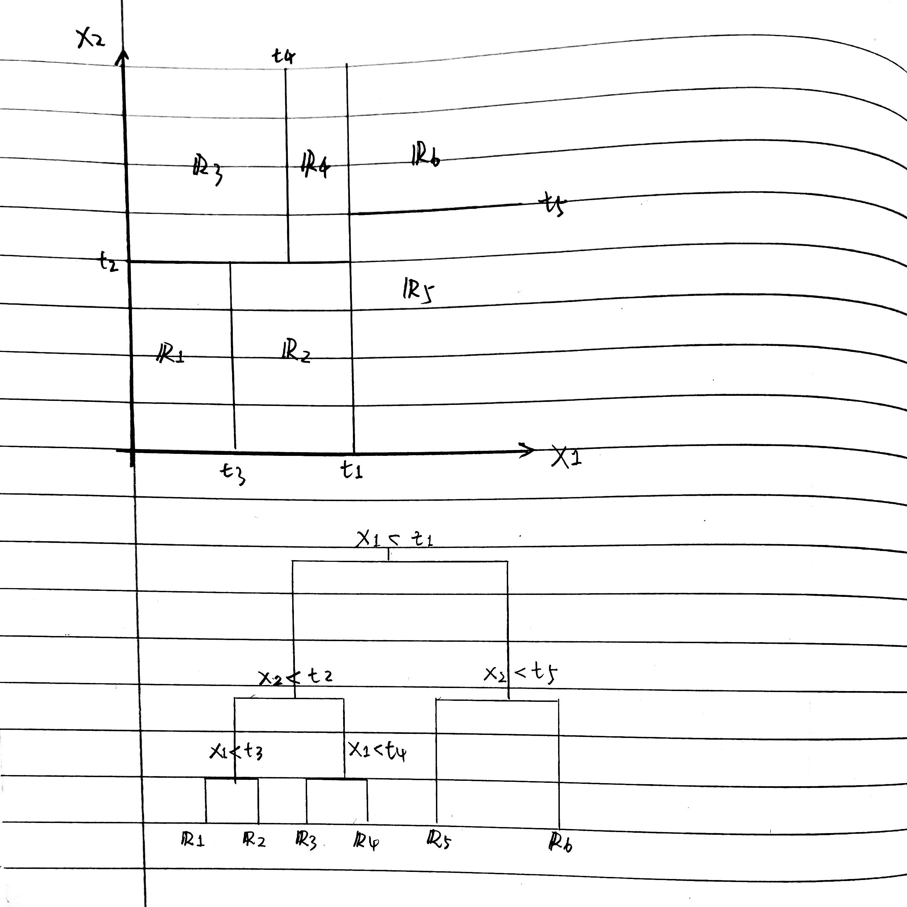

```{r setup, include=FALSE}
knitr::opts_chunk$set(echo = TRUE)
library(ISLR2)
library(tidyverse)
library(dplyr)
library(MASS)
library(e1071)
library(arm)
library(formattable)
library(class)
library(ggplot2)
library(randomForest)
library(tree)
library(BART)
library(gbm)
library(jpeg)
```

## 8.1

Draw an example (of your own invention) of a partition of two- dimensional feature space that could result from recursive binary splitting. Your example should contain at least six regions. Draw a decision tree corresponding to this partition. Be sure to label all as- pects of your figures, including the regions R1, R2, . . ., the cutpoints t1,t2,..., and so forth.

_Answer_:

See Appendix


## 8.2

_Answer_:

Firstly, fit a decision stump to training set $(x_i, y_i), i = 1, 2, ..., N$, denote this stump as $f_1(X)$. Then calculate residual $r^1 = Y - \lambda f_1(X)$ and fit the second decision to set $(x_i, r^1_i), i = 1, 2, ..., N$, denoting the second stump as $f_2(X)$. At this stage, the latest model is $f(X) = f_1(X) + f_2(X)$. Repeat the stage for $p$ times and get the final model $f(X) = f_1(X) + f_2(X) + ... + f_p(X)$. 


## 8.3

_Answer_:

```{r, fig.height=4, fig.width=6}
p <- seq(from = .01, to = .99, by = .01)
gini_index <- p* (1 - p)* 2
classification_error <- c()
for (i in 1: length(p)) {
  classification_error[i] <- 1 - max(p[i], 1 - p[i])
}
entropy <- -(p* log(p, base = 2) + (1 - p)* log(1-p, base = 2))
data <- data.frame(
  rbind(cbind(p = p, value = gini_index, 
                         type = rep("gini_index", length(gini_index))), 
        cbind(p = p, value = classification_error, 
              type = rep("classification_error", length(classification_error))), 
        cbind(p = p, value = entropy, type = rep("entropy", length(entropy)))))
data$type <- factor(data$type)
data$p <- as.numeric(data$p)
data$value <- as.numeric(data$value)
ggplot(data = data) + 
  geom_line(aes(x = p, y = value, color = type, linetype = type), lwd = 1) + 
  theme(legend.position = "bottom") + 
  ggtitle("Camparsion of Gini, Class_err and entropy")
```


## 8.5

_Answer_:

* _majority vote_: 6 vs 4
  * final classification: red

* _average probability_: .45
  * final classification: green 


## 8.7

```{r, fig.width=8, fig.height=4, warning=FALSE}
# Boston
# mtry: # of predictors to use; ntree: # of tree to grow 
set.seed(1623)
train <- sample(1:nrow(Boston), 0.7*nrow(Boston))
train.boston <- Boston[train, ]
test.boston  <- Boston[-train, ]
train.X <- train.boston[, -14]
train.Y <- train.boston[, 14]
test.X <- test.boston[, -14]
test.Y <- test.boston[, 14]
p <- ncol(train.X)
ntrees <- 500
# train.mse <- c()
# test.mse <- c()
# for (i in 1: ntrees) {
#   rf.boston <- randomForest(x = train.X, y = train.Y, 
#                           ntree = i, mtry = 6)
#   train.mse[i] <- mean((train.Y - predict(rf.boston, newdata = train.X))^2)
#   test.mse[i]  <- mean((test.Y  - predict(rf.boston, newdata =  test.X))^2)
# }
# train.mse
# test.mse
 
test.mse <- c()
type <- c()
mtry <- c(round(p/2), round(sqrt(p)), p)
for (i in mtry) {
  rf.boston <- randomForest(x = train.X, y = train.Y, 
                            xtest = test.X, ytest = test.Y, 
                            ntree = ntrees, mtry = i)
  test.mse <- c(rf.boston$test$mse, test.mse)
}
for (i in mtry) {
  type <- c(type, paste("mtry = ", rep(i, ntrees), sep = ""))
}
plot.data <- data.frame(
  ntrees = rep(c(1:ntrees), length(mtry)),
  MSE = test.mse, 
  type = factor(type))
ggplot(data = plot.data) + 
  geom_line(aes(x = ntrees, y = MSE, group = type, color = type)) + ylim(10, 20)
```


## 8.8

### (a)

```{r, warning=FALSE}
# Carseats$Sales
rm(test.X, train.X, plot.data, train.boston, test.boston, 
   mtry, ntrees, train.Y, test.Y, type)
set.seed(1141)
train <- sample(1:nrow(Carseats), 200)
High <- factor(ifelse(Carseats$Sales <= 8, "No", "Yes"))
train.X <- Carseats[train, -1]
test.X  <- Carseats[-train, -1]
train.Y <- High[train]
test.Y  <- High[-train]
training <- cbind(Sales = train.Y, train.X)
test <- cbind(Sales = test.Y, test.X)
```

### (b)

```{r}
carseat.tree <- tree(Sales~., data = training)
summary(carseat.tree)
plot(carseat.tree)
text(carseat.tree, pretty = 0)
predict.Y <- predict(carseat.tree, newdata = test.X, type = "class")
confusion.mtrx <- table(test.Y, predict.Y)
test.MSE <- paste((confusion.mtrx[1, 1] + confusion.mtrx[2, 2])/nrow(test)*100,
                  "%", sep = "")
cat("test MSE = ", test.MSE)
```

### (c)

```{r, fig.height=4, fig.width=6}
carseat.cv <- cv.tree(carseat.tree, FUN = prune.misclass) 
# k: alpha *|T|; 
# dev: # of cv errors
plot(carseat.cv$size, carseat.cv$dev, type = "b", xlab = "tree.size", ylab = "cv.error")
prune.carseats <- prune.misclass(carseat.tree, best = 8)
predict.Y <- predict(prune.carseats, newdata = test.X, type = "class")
confusion.mtrx <- table(test.Y, predict.Y)
test.MSE <- paste((confusion.mtrx[1, 1] + confusion.mtrx[2, 2])/nrow(test)*100,
                  "%", sep = "")
cat("new test MSE = ", test.MSE)
```

_Answer_: 

the performance of pruned tree on test data is nearly the same with unpruned tree. 

### (d)

```{r}
ntrees <- 500
mtry <- ncol(train.X)
bagging.carseats <- randomForest(x = train.X, y = train.Y, 
                                 ntree = ntrees, mtry = mtry, importance = TRUE)
predict.Y <- predict(bagging.carseats, newdata = test.X, type = "class")
confusion.mtrx <- table(test.Y, predict.Y)
test.MSE <- paste((confusion.mtrx[1, 1] + confusion.mtrx[2, 2])/nrow(test)*100,
                  "%", sep = "")
cat("new test MSE = ", test.MSE)
importance(bagging.carseats)
```

_Answer_: 

Yeah, bagging improve test MSE from 71% to 79%! According to the importance result, CompPrice, Income, Advertising, Price, ShelveLoc and Age are most important. 

\newpage

### (e)

```{r, fig.height=4, fig.width=6}
mtry <- 1:10
test.mse <- c()
for (i in mtry) {
  set.seed(i*1000)
  rf.carseats <- randomForest(x = train.X, y = train.Y, 
                            ntree = ntrees, mtry = i)
  predict.Y <- predict(rf.carseats, newdata = test.X, type = "class")
  confusion.mtrx <- table(test.Y, predict.Y)
  test.mse <- c(test.mse, 
                (confusion.mtrx[1, 1] + confusion.mtrx[2, 2])/nrow(test))}
plot(mtry, test.mse, type = "b")
# when m = 8, random forest model achieves the best performance
rf.carseats <- randomForest(x = train.X, y = train.Y, 
                            ntree = ntrees, mtry = 7, 
                            importance = TRUE)
importance(rf.carseats)
```

_Answer_: 

the best performance appears when m = 8. the MSE of this random forest model is 79.5% and the most important predictors are CompPrice, Income, Advertising, Price, ShelveLoc and Age, which are exactly the same with bagging forest result. 


## 8.11

### (a)

```{r}
rm(bagging.carseats, carseat.cv, carseat.tree, data, prune.carseats, rf.boston, 
   rf.carseats, test, training, test.X, train.X)
rm(classification_error, confusion.mtrx, mtry, ntrees, predict.Y, test.mse, 
   test.MSE, test.Y, train.Y)
library(ISLR)
train = 1:1000
data <- Caravan
data$Purchase = ifelse(Caravan$Purchase == "Yes", 1, 0)
train.set <- data[train, ]
test.set  <- data[-train, ]
```

### (b)

```{r, warning=FALSE}
Carvan.boost <- gbm(Purchase~., data = train.set, 
                    n.trees = 1000, shrinkage = 0.01, distribution = "bernoulli")
summary(Carvan.boost)
```

_Answer_:

PPERSAUT is the most important predictor. 

### (c)

```{r}
prob <- predict(Carvan.boost, newdata = test.set, n.trees = 1000, type = "response")
predict.Y <- ifelse(prob > .2, 1, 0)
confusion.mtrx <- table(test.set$Purchase, predict.Y)
```

```{r}
confusion.mtrx[2, 2]/(confusion.mtrx[1, 2] + confusion.mtrx[2, 2])
```

_Answer_: 

Around 20% of people predicted to make a purchase and actually made a purchase. 

```{r}
# which(colnames(train.set) == "Purchase")
train.X <- train.set[, -86]
train.Y <- train.set[,  86]
test.X <- test.set[, -86]
test.Y <- test.set[,  86]
knn.acc <- c()
for (i in 5:30) {
  Caravan.knn <- knn(train = train.X, test = test.X, cl = train.Y, k = i, prob = TRUE)
  confusion.mtrx <- table(test.Y,Caravan.knn)
  knn.acc <- c(knn.acc, (confusion.mtrx[1, 1] + confusion.mtrx[2, 2])/nrow(test.X))
}
plot(5:30, knn.acc, type = "b")
```

KNN predicts everybody to be no purchase! 


\newpage

## Appendix

```{r, echo=FALSE}

```


